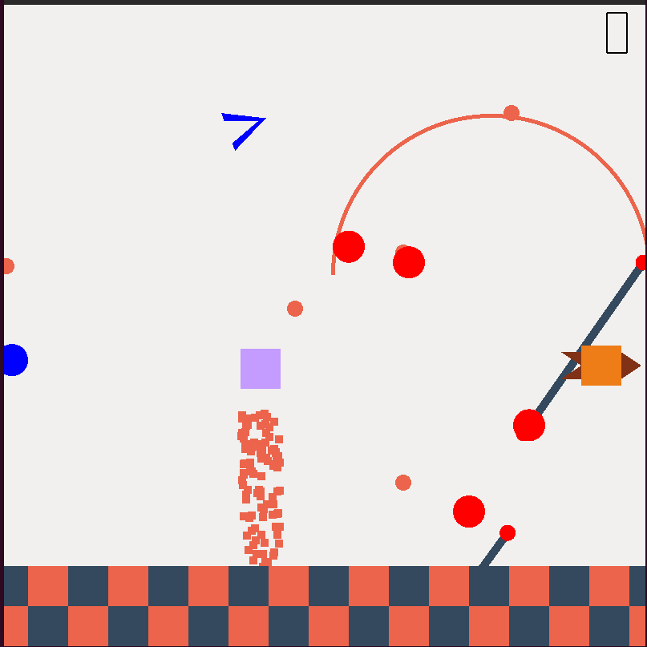
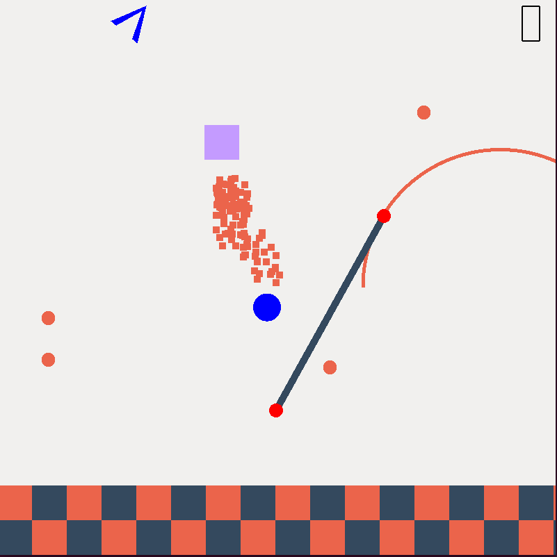

BlockJet-lite
==============

This is 'a clone'. Due to lack of advancement in cloning humanoids, our clone looks like a block!

## INSTALL (UBUNTU)
```bash
sudo apt install libglew-dev libglfw3-dev libglm-dev cmake pkg-config
sudo chmod a+x run.sh
./run.sh
```
## FEATURE HIGHLIGHTS
* Score on screen using custom seven segment display.
* Particle effects.
* Endless running.
* 8 Direction shooting!

## SCREEN SHOTS

  
  
    


## CONTROLS
W   -> Jetpack  
A   -> Move Left  
D   -> Move Right  

Q   -> Quit

Arrow Keys -> 8 directions shooting
